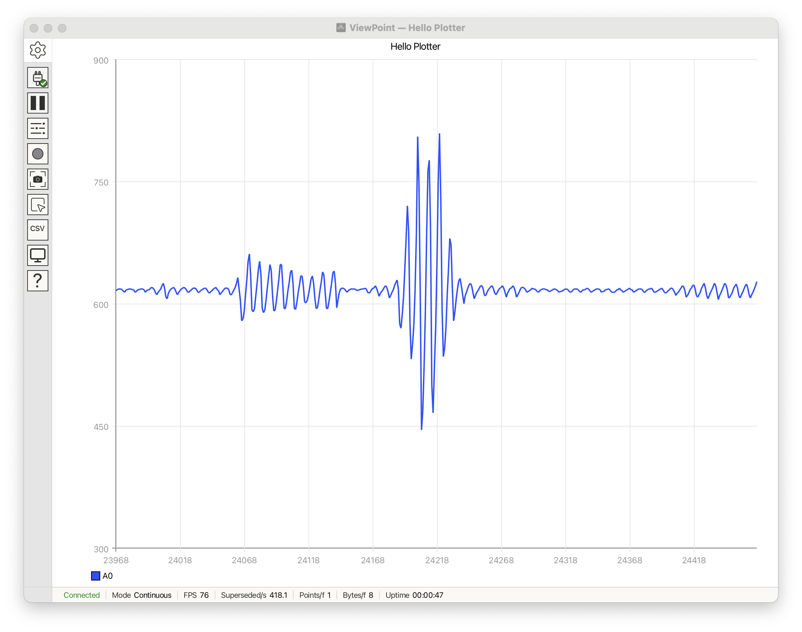

# ViewPoint Arduino Library

@date June 01, 2026
@version 1.0.1
Protocol: V1R1

## Sketches Included

### Cartesian
1. **HelloPlotter** — The Hello World of ViewPoint; the minimum code to get a live plot on screen.
2. **Quadrature** — Animated sine/cosine waveforms with gentle amplitude modulation to introduce multiple traces.
3. **HeartbeatECG** — Simulated ECG monitor display with domain-specific grid styling.
4. **MultiSensorDashboard** — Industrial-style multi-sensor dashboard with multiple independently configured plots.
7. **ViewPoint_AM_Demo_R1** — Frames-mode animation of an amplitude-modulated signal with carrier, modulation, and noise.
8. **SpectrumAnalyzer** — Real-time FFT spectrum analyzer using frames mode.
9. **SignalAndNoise** — Side-by-side time and frequency domain visualization.
10. **SignalAnalyzer_A0** — Dual-domain signal analyzer with triggered oscilloscope and FFT spectrum on A0 at 800 kSPS via DMA.
11. **AliasingExplorer** — Nyquist sampling theorem demonstration sweeping a sine wave through and beyond the Nyquist limit with reconstructed vs. true signal comparison.
12. **WindowFunctionExplorer** — Four stacked FFT plots comparing Rectangle, Hamming, Blackman-Harris, and Flat-Top window functions on closely-spaced tones.

### Scatter
1. **HelloScatter** — Minimal scatter plot example to get points on screen quickly.
2. **EtchASketch** — Classic drawing toy simulation using dual rotary encoders for X/Y control.
3. **LissajousCurve** — Rotating Lissajous figure rendered as a scatter plot.
4. **VibrationAnalysisXY** — Orbit plots for rotating machinery vibration analysis with selectable fault types.
5. **Fireworks** — Particle-physics fireworks display with projectile motion, radial bursts, and HSV color fading over a city skyline.
6. **EntropyEngine** — 2D ideal gas simulation demonstrating the second law of thermodynamics with thermal speed-band coloring.
7. **AnimatedTextBanner** — Orbiting vector text animation drawing "VoidLoop" and "ViewPoint" as polyline strokes with cycling HSV color gradients.
8. **HolographicSurfaces** — 3D mathematical surfaces (torus, Klein bottle, Mobius strip, sphere) rendered as depth-graded wireframes with Euler rotation.

### Polar
1. **HelloPolar** — The simplest polar plot example. Data is read from A0 and theta is incremented with each point.
2. **CustomGrid** — Demonstrates custom polar grid styling and units with animated harmonic curves.
3. **MotorEncoderMonitor** — Rotational position/velocity display for encoder-style signals.
4. **EncoderDraw** — Dual-encoder polar drawing tool with degrees/radians mode switching.
5. **WindRoseChart** — Wind direction histogram rendered as a wind-rose chart.
6. **PolarPhasorDiagram** — Three-phase AC power system phasor diagram cycling through balanced, fault, and distortion conditions.

### ViewSauce
1. **ViewSauce** — Full-feature showcase cycling through all three plot types, both modes, all display modes, multi-plot layouts, FFT analysis, 3D wireframes, and fireworks.


---

# ViewPoint

An Arduino library that streams high-speed serial data to the ViewPoint
desktop application, which renders it as live plots and analysis views.

The library handles the sketch side: it defines plot types, modes, traces,
axes, labels, and the actual data stream. The desktop app handles port
discovery, live rendering, inspection, capture, and export. In practice
ViewPoint sits somewhere between a serial plotter, a live instrumentation
tool, and a lightweight analysis environment.

The desktop app is a separate download that can be purchased at https://shop.voidloop.com/products/viewpoint

---

## What You'll See

The smallest end-to-end sketch:

```cpp
#include <ViewPoint.h>

void setup() {
    view.begin();
    view.setTitle("Hello Plotter");
}

void loop() {
    view.addData("A0", analogRead(A0));
    view.send();
}
```

Upload this, open the desktop app, and select the board's serial port from
**Settings**. ViewPoint draws a single Cartesian plot titled "Hello
Plotter" with one trace labelled **A0**, scrolling left to right as new
samples arrive. With a floating input, the trace shows ambient ADC noise;
with a potentiometer on **A0**, the trace tracks the wiper voltage.

<!-- Screenshot: HelloPlotter running live — Cartesian plot with a single
     trace from A0 scrolling left to right on default axes -->


If the port does not appear in the **Settings** list, or ViewPoint cannot connect to it, ensure the Arduino
Serial Monitor and Serial Plotter are both closed. If the port is being used by any other application ViewPoint will be unable to connect to it.

---

## Install

### Arduino Library Manager

In the Arduino IDE, open **Tools → Manage Libraries**, search for
**ViewPoint**, and click **Install**.

### PlatformIO

Add the library to `platformio.ini`:

```ini
lib_deps =
    voidloop/ViewPoint
```

### Manual install

Clone or download the repository into the Arduino libraries directory:

```bash
cd ~/Documents/Arduino/libraries
git clone https://github.com/voidloopers/ViewPoint.git
```

The libraries folder is found within the Arduino `sketchbook` folder, which the location of can be found within the `Settings` dialog. Click `Arduino IDE` -> `Settings` and look for the `Sketchbook location` text box. The `libraries` folder is not necessarily auto created - if it does not yet exist, simply create the folder and copy ViewPoint into it. Restart the IDE.

Restart the Arduino IDE so it picks up the new library.

Confirm the install by opening the **HelloPlotter** example
(**File → Examples → ViewPoint → Cartesian → HelloPlotter**) and uploading
it to a board.

---

## Concepts

A handful of terms recur through the rest of this document and through
every example sketch. Each one maps to a single object or enum in the
library.

### `view`

`view` is the global `Plotter` instance — the single entry point for every
sketch. Including `<ViewPoint.h>` brings it into scope. Sketches call
`view.begin()`, `view.addData(...)`, `view.send()`, and the rest of the
configuration API on this one object. There is no second instance to
construct.

```cpp
#include <ViewPoint.h>

void setup() { view.begin(); }
void loop()  { view.addData("A0", analogRead(A0)); view.send(); }
```

### Trace

A **trace** is a named series of float samples drawn inside a plot. A
trace can carry single values (`addData("A0", value)`) for Cartesian
plotting, or paired values (`addData("Orbit", x, y)`) for Scatter and
Polar plotting. Traces are created on first reference by label; numeric
ids can also be used. A sketch can stream multiple traces in the same
`send()` cycle.

### Plot

A **plot** is one panel on the canvas: a pair of axes, the traces drawn
inside, an optional title, and optional grid styling. A session starts
with one plot. Calling `view.setNumberOfPlots(n)` adds more. Per-plot
configuration is reached through `view.plot(i)`, which returns a `Plot&`
exposing the same axis, title, units, display-mode, and reference-line
calls available on `view` itself. When a sketch defines multiple traces
and multiple plots without explicit mapping, the desktop app automaps
traces to plots in index order — first trace to the top plot, last trace
to the bottom plot.

### Mode

A sketch streams data in one of two **modes**.

| Mode | Behavior | Good for |
|---|---|---|
| `Mode::Continuous` | each `send()` appends one point per trace | live telemetry, scrolling sensor streams |
| `Mode::Frames` | each `send()` replaces the whole frame | FFTs, windowed analysis, fixed-size blocks |

Continuous mode is the default. Frames mode is selected with
`view.begin(frames, packetSize)` or `view.setMode(frames)`. Frames mode
sends a `[frames]complete=true` marker at the end of each packet, which
the desktop app uses to align display modes like Persistence and
Spectrogram.

### PlotType

A **plot type** selects how the desktop app renders the data.

| Plot type | Best for | Typical data shape |
|---|---|---|
| `PlotType::Cartesian` | time series, sampled values, general telemetry | one value per point |
| `PlotType::Scatter` | phase plots, paired channels, trajectories | paired values `(x, y)` |
| `PlotType::Polar` | directional, rotational, angular data | magnitude plus angle |

Cartesian is the default. Scatter and Polar take paired data through
`addData(label, x, y)`.

### DisplayMode

A **display mode** is a rendering style layered onto a Cartesian plot in
Frames mode. On any other plot type or in Continuous mode, the display
mode is ignored.

| Display mode | What it does |
|---|---|
| `DisplayMode::None` | normal rendering, no overlay |
| `DisplayMode::Persistence` | older frames remain visible with alpha blending |
| `DisplayMode::Spectrogram` | waterfall, time on one axis and frame index on the other |
| `DisplayMode::Gradient` | per-pixel hit count rendered as a color spectrum |

Set with `view.setDisplayMode(spectrogram)` or
`view.setDisplayMode(persistence, traceId)`.

### Namespace Shortcut Macros

`viewpoint` is the library's namespace. Every enum value has a fully
qualified form (`viewpoint::PlotType::Scatter`, `viewpoint::Mode::Frames`)
and a short macro form for the most common values:

| Macro | Expands to |
|---|---|
| `cartesian` | `viewpoint::PlotType::Cartesian` |
| `scatter`, `xy` | `viewpoint::PlotType::Scatter` |
| `polar` | `viewpoint::PlotType::Polar` |
| `continuous` | `viewpoint::Mode::Continuous` |
| `frames` | `viewpoint::Mode::Frames` |
| `persistence` | `viewpoint::DisplayMode::Persistence` |
| `spectrogram` | `viewpoint::DisplayMode::Spectrogram` |
| `gradient` | `viewpoint::DisplayMode::Gradient` |

The Hello sketches use the macro form. Showcase sketches that pull in
several enums commonly write `using namespace viewpoint;` and use the
fully qualified forms instead.

If a macro name collides with another library in the sketch, opt out
before the include:

```cpp
#define USE_VIEWPOINT_WITH_NAMESPACE
#include <ViewPoint.h>
```

With the opt-out in place, only the fully qualified forms are available.

### Legacy Mode

`view.setLegacyMode(true)` switches the library into a data-only stream
suitable for non-ViewPoint receivers — the Arduino IDE **Serial Plotter**,
third-party serial plotters, or headless CSV logging. In legacy mode the
library skips the `[viewpoint]` handshake, omits frame-complete markers,
and clamps each `send()` to 500 points so the Arduino Serial Plotter
parser stays in sync.

```cpp
void setup() {
    view.begin();
    view.setLegacyMode(true);
}
```

Without legacy mode, the library waits for the desktop app to announce
its protocol version before emitting any configuration commands. Until
that handshake completes, only data lines are sent — so the Arduino
Serial Plotter still sees a clean CSV stream by default. Legacy mode is
the right switch when the sketch is targeting Serial Plotter
deliberately and wants to opt out of waiting on the handshake entirely.

---

## Configuration and Defines

Two layers of build-time configuration tune the library's footprint and
behavior: a memory profile that sets a coherent group of defaults, and
individual override macros that fine-tune any single value.

### Memory Profile Macros

A memory profile is one of three preset bundles. Define it before
`#include <ViewPoint.h>`:

```cpp
#define VIEWPOINT_FULL
#include <ViewPoint.h>
```

If no profile is set, the library auto-selects one from the target board.
Small AVR boards (UNO R3, Nano, Leonardo, Micro) get `VIEWPOINT_MINIMAL`.
Mega 2560 and UNO R4 (Renesas) get `VIEWPOINT_LITE`. Every other board
falls through to `VIEWPOINT_FULL`. The library emits a `#warning` line at
compile time when it auto-selects MINIMAL or LITE, so a build that picked
a tight profile by accident is visible in the compiler output.

| Macro | Max traces | Max plots | Traces/plot | Derived traces | Reference lines | Packet size | Label size | Units size | Title size | TX buffer | Auto-selected on |
|---|---|---|---|---|---|---|---|---|---|---|---|
| `VIEWPOINT_MINIMAL` | 2 | 1 | 2 | 1 | 2 | 50 | 16 | 8 | 16 | 32 | small AVR (UNO R3, Nano, Leonardo, Micro) |
| `VIEWPOINT_LITE` | 4 | 2 | 4 | 4 | 4 | 100 | 24 | 12 | 32 | 128 | Mega 2560, UNO R4 |
| `VIEWPOINT_FULL` | 16 | 8 | 16 | 32 | 8 | 500 | 32 | 16 | 64 | 512 | everything else (Teensy, ESP32, Giga, Pico, STM32, …) |

A FULL build on a Teensy 4.1 costs roughly 4–6 KB of static RAM. A
MINIMAL build on an UNO R3 fits in roughly 1.5 KB of SRAM with room for
typical sketch state. Pick a tighter profile than the auto-selection only
when the sketch needs every byte for its own buffers, and a looser one
when the auto-detect was too conservative for the board.

### Individual Override Macros

Every value the memory profile sets is also accessible as its own define.
Set any of these before `#include <ViewPoint.h>` to override a single
field without changing the rest of the profile.

| Macro | Default (MINIMAL / LITE / FULL) | What it controls |
|---|---|---|
| `VIEWPOINT_MAX_TRACES` | 2 / 4 / 16 | Maximum simultaneous traces |
| `VIEWPOINT_MAX_PLOTS` | 1 / 2 / 8 | Maximum plot panels |
| `VIEWPOINT_MAX_TRACES_PER_PLOT` | 2 / 4 / 16 | Trace ids per plot's association list |
| `VIEWPOINT_MAX_REFERENCE_LINES` | 2 / 4 / 8 | Reference lines per axis |
| `VIEWPOINT_MAX_DERIVED_TRACES` | 1 / 4 / 32 | Derived-trace slots — may be removed in a future release; the desktop app's UI is the recommended path |
| `VIEWPOINT_LABEL_SIZE` | 16 / 24 / 32 | Bytes per trace and plot label, including null terminator |
| `VIEWPOINT_UNITS_SIZE` | 8 / 12 / 16 | Bytes per axis-units string |
| `VIEWPOINT_TITLE_SIZE` | 16 / 32 / 64 | Bytes per sketch and plot title |
| `VIEWPOINT_DEFAULT_PACKET_SIZE` | 50 / 100 / 500 | Default points per frame in Frames mode |
| `VIEWPOINT_TX_BUF_SIZE` | 32 / 128 / 512 | `CommandEncoder` transmit-batching buffer |
| `VIEWPOINT_CONFIG_RESEND_COOLDOWN_MS` | 200 | Minimum gap between full configuration resends when the app sends `?` |
| `USE_VIEWPOINT_WITH_NAMESPACE` | (off) | Disables the namespace shortcut macros so identifiers like `scatter` and `frames` stay in the user's namespace |

Override one value like this:

```cpp
#define VIEWPOINT_MAX_TRACES 8
#include <ViewPoint.h>

void setup() { view.begin(); }
void loop()  {}
```

---

## Examples Tour

The examples ship under `examples/` grouped by plot type. Each subgroup
opens with a Hello sketch — the smallest end-to-end example for that
plot type. The rest of the group covers timing patterns, domain styling,
multi-plot layouts, and complete showcases.

### Cartesian

Cartesian plots are the default and the right starting point for any
time-series, sampled signal, or general telemetry stream.

- **HelloPlotter** — the minimum Cartesian sketch. Reads `A0`, sends one
  trace, scrolls left to right. The right first check that the install,
  port, and basic streaming all work.
- **TimedPlotter** — same idea as HelloPlotter, but uses `micros()` to
  hold a stable sample rate independent of `delay()` jitter. Use this
  when the sample rate has to be known (frequency analysis, time
  correlation, cross-run comparisons).
- **Quadrature** — sine and cosine in quadrature with slow amplitude
  modulation. Compact compare-and-contrast of Continuous versus Frames
  mode on paired traces, with no external hardware.
- **HeartbeatECG** — synthetic ECG with medical-style grid colors and
  reference lines (1 mV = 10 mm vertically, 25 mm/sec sweep). Shows
  domain-specific styling, custom grid colors, and Continuous mode used
  as a strip chart.
- **MultiSensorDashboard** — four stacked plots: temperature, vibration,
  pressure, status. Each plot has its own scale, units, and thresholds.
  Demonstrates `setNumberOfPlots()`, per-plot configuration via
  `view.plot(i)`, and the trace-to-plot automap rule (first trace on
  the top plot, last trace on the bottom plot).
- **AliasingExplorer** — pedagogy sketch that sweeps a sine wave through
  the Nyquist boundary so the alias appears on screen. Generates its
  signal with plain math — no DSP library required.

### Scatter

Scatter plots take paired `(x, y)` values. Use them for phase plots,
trajectories, constellation diagrams, and any data where the relationship
between two channels matters more than either channel alone.

- **HelloScatter** — the minimum Scatter sketch. Reads `A0` and `A1`,
  plots them as X-Y pairs. First check for the `addData(label, x, y)`
  form.
- **TimedScatter** — paired-sample variant with `micros()`-driven
  timing. The X and Y reads are taken at the same instant per cycle, so
  the pairing stays coherent under heavy loop work.
- **LissajousCurve** — parametric Lissajous figure rotating in the
  XY plane. A good representative of Scatter+Frames workflows with
  generated data and no external hardware.

### Polar

Polar plots take magnitude plus angle. Use them for directional,
rotational, or angular data: compasses, wind roses, rotor positions,
radar-style sweeps.

- **HelloPolar** — the minimum Polar sketch. Sweeps one degree at a
  time while sampling `A0`. First check that the polar layout and
  radial autoscaling behave as expected.
- **TimedPolar** — fixed sample rate and explicit sweep speed
  (`SWEEP_RPM`). Decouples the sampling cadence from the angular step
  so both are independently tunable.
- **CustomGrid** — degrees-versus-radians comparison with custom grid
  styling, angular offset, and reference circles. Reach for this when
  the polar layout needs to match a specific convention (compass
  bearing, mathematical convention, etc.).

### Full Showcase

- **ViewSauce** — a ten-scene state machine that cycles through every
  plot type, both modes, every display mode, multi-plot layouts, and a
  set of synthetic demos including FFT spectrum sweep, 3D wireframe
  rendering, and particle-physics fireworks. The DSP-driven scenes
  (FFT spectrum, AM demo) use the SignalCore library — see
  https://docs.voidloop.com/libraries/SignalCore/. Best
  single sketch for getting a feel for the library's range; each scene
  has a standalone smaller example under `examples/`.

---

## API Reference

Every public method on `view` (the `Plotter` instance), grouped by
purpose. Defaults shown in parentheses. The "Desktop result" column
describes the visible effect once the desktop app is connected and
negotiated.

### Lifecycle

| Method | Behavior | Desktop result |
|---|---|---|
| `begin(unsigned long baud = 115200, PlotType type = Cartesian, Mode mode = Continuous, int packetSize = VIEWPOINT_DEFAULT_PACKET_SIZE)` | Initialize default `Serial` at `baud`, set the trailing plot type, mode, and packet size, start protocol negotiation | App opens the session and reports connection on the next `[viewpoint]version=` exchange |
| `begin(Stream& serial, PlotType type = Cartesian, Mode mode = Continuous, int packetSize = VIEWPOINT_DEFAULT_PACKET_SIZE)` | Use a caller-initialized `Stream` (the caller owns `serial.begin()`); same trailing defaults | Same handshake, on the supplied stream |
| `begin(PlotType type, Mode mode = Continuous, int packetSize = VIEWPOINT_DEFAULT_PACKET_SIZE)` | Default `Serial` at 115200, leading with plot type | App opens with the chosen plot type |
| `begin(Mode mode, int packetSize = VIEWPOINT_DEFAULT_PACKET_SIZE)` | Default `Serial` at 115200, Cartesian by default, leading with mode | App opens in the chosen mode |
| `reset()` | Free library-owned traces, clear plot config, restore type/mode/packet defaults; triggers a full handshake on next `send()` | App clears all state on the next `[viewpoint]version=…` |
| `removeTrace(int id)` | Free the trace at `id`, drop any derived traces that referenced it, force a full handshake | App removes the trace and its legend entry |
| `clearTraces()` | Free every trace and derived trace; force a full handshake | App clears all traces |
| `clearPlots()` | Reset every plot's title, axes, grid, display mode, and trace list | App resets all plot configuration |

The four `begin(...)` overloads cover the four natural starting shapes:
default `Serial` with optional baud and trailing defaults, a
caller-provided `Stream`, plot-type-first, or mode-first. Default
arguments fill in the rest, so a sketch can write `view.begin()`,
`view.begin(scatter)`, `view.begin(frames, 512)`, or
`view.begin(Serial1, polar, frames, 360)` without juggling argument
order beyond the leading type.

### Plot Type, Mode, and Cadence

| Method | Behavior | Desktop result |
|---|---|---|
| `setPlotType(PlotType)` | Set Cartesian, Scatter, or Polar; switching to Polar forces packet size to 360 | App switches to the chosen layout |
| `setMode(Mode)` | Set Continuous or Frames; sets a sensible default `delayMs_` for each (2 ms / ~16.7 ms) and enables TX buffering in Frames mode | App treats the stream as live points or bounded frames |
| `setPacketSize(int size)` | Set the points-per-frame target in Frames mode | App expects this many points per `[frames]complete=true` |
| `setDelay(float ms)` | Override the inter-sample (Continuous) or inter-frame (Frames) delay in milliseconds | None directly — slows or speeds the stream rate |
| `setLegacyMode(bool)` | Bypass the `[viewpoint]` handshake, suppress frame-complete markers, clamp `send()` to 500 points per call | None — legacy mode targets non-ViewPoint receivers |

### Default Plot Configuration

These calls configure the **default plot** — the implicit plot every
sketch starts with. In a multi-plot sketch, the same setters are
available on `view.plot(i)` for per-plot configuration.

| Method | Behavior | Desktop result |
|---|---|---|
| `setVerticalRange(min, max)` | Set the y-axis range | App draws the y-axis with these bounds |
| `setVerticalRange(min, max, int divisions)` | Range plus division count | Axis gridlines split into `divisions` segments |
| `setVerticalRange(min, max, float minor, float major)` | Range plus explicit minor and major step | Axis gridlines at the given spacings |
| `setHorizontalRange(min, max)` and overloads | Same idea for the x-axis | App draws the x-axis with these bounds |
| `setUnits(const char* h, const char* v)` | Set horizontal and vertical unit strings | Units appear in the axis labels |
| `setRadialRange(min, max)` and overloads | Polar radial limits and divisions; mirrors the vertical-range API | App draws the radial axis from min to max |
| `setAngularOffset(float)` | Rotate the polar angle reference | Polar grid rotates by this offset |
| `setAngularStep(int)` | Set the angular grid spacing | Polar grid lines step by this amount |
| `setAngularUnits(AngularUnit)` | Switch between degrees and radians | App interprets incoming angle values accordingly |
| `setRadians()` | Shortcut for `setAngularUnits(Radians)` | Same as above |
| `setAxisLabels(const char* h, const char* v)` | Set the axis label text (independent of units) | App shows the labels next to each axis |
| `setTitle(const char* title)` | Set the sketch-level title, shown above the plot region and in the window title | App displays the sketch title |
| `setPlotTitle(const char* title)` | Set the title of the default plot | App displays the plot title |

### Logarithmic Scale

| Method | Behavior | Desktop result |
|---|---|---|
| `enableLogarithmicScale(bool mapData = true)` | Enable log scaling on the default plot's vertical axis. `mapData=true` means trace data is linear and the app maps it; `false` means data is already in log-space (e.g., dB) and is plotted linearly against log-spaced axis bounds | App renders the y-axis with log gridlines and treats incoming data as configured |
| `disableLogarithmicScale()` | Disable log scaling on the vertical axis | App reverts to linear y-axis |

For axis-specific control, use `view.plot(i).enableLogarithmicScale(axis, mapData)`.

### Grid and Reference Lines

| Method | Behavior | Desktop result |
|---|---|---|
| `setGridColors(uint32_t minor, uint32_t major)` | Set the minor and major gridline colors | Grid redraws with the chosen colors |
| `setGridColors(uint32_t labels, uint32_t minor, uint32_t major)` | Also sets axis-label color | Labels and gridlines redraw with the chosen colors |
| `addHorizontalReferenceLine(float value, bool isMajor = false)` | Add a *horizontal line* on the **vertical axis** at `value`. The line is drawn flat across the plot at constant y and returns its reference-line index, or `-1` at capacity | App overlays a horizontal line at the given y-value |
| `addHorizontalReferenceLine(float value, uint32_t color, float stroke = 1.0f)` | Same with explicit color and stroke. Returns the reference-line index, or `-1` at capacity | Same, in the requested color and weight |
| `updateHorizontalReferenceLine(int index, float value, uint32_t color = NO_COLOR, float stroke = -1.0f)` | Move an existing horizontal reference line. `NO_COLOR` keeps the current color; a negative stroke keeps the current stroke | App updates the existing horizontal line instead of adding a new one |
| `addVerticalReferenceLine(float value, bool isMajor = false)` | Add a *vertical line* on the **horizontal axis** at `value`. The line is drawn straight up at constant x and returns its reference-line index, or `-1` at capacity | App overlays a vertical line at the given x-value |
| `addVerticalReferenceLine(float value, uint32_t color, float stroke = 1.0f)` | Same with explicit color and stroke. Returns the reference-line index, or `-1` at capacity | Same, in the requested color and weight |
| `updateVerticalReferenceLine(int index, float value, uint32_t color = NO_COLOR, float stroke = -1.0f)` | Move an existing vertical reference line. `NO_COLOR` keeps the current color; a negative stroke keeps the current stroke | App updates the existing vertical line instead of adding a new one |

### Display Modes

| Method | Behavior | Desktop result |
|---|---|---|
| `setDisplayMode(DisplayMode mode)` | Apply a display mode to the default plot (Cartesian + Frames only) | App switches the plot's renderer to the chosen mode |
| `setDisplayMode(DisplayMode mode, int traceId)` | Same, scoped to one trace | App applies the display mode to that trace's drawing only |

### Multi-Plot

| Method | Behavior | Desktop result |
|---|---|---|
| `setNumberOfPlots(int count)` | Allocate `count` plot panels (clamped to `VIEWPOINT_MAX_PLOTS`) | App splits the canvas into the requested number of stacked plots |
| `plot(int index)` | Return a `Plot&` for the plot at `index`. The returned object exposes the same axis, title, units, display-mode, and reference-line API as `view` itself | None directly — subsequent setters on the returned `Plot` configure that panel |

A `Plot` configures one panel: its title, both axes (range, divisions,
units, labels, log scale, reference lines), grid colors, display mode,
and trace association list. See `src/viewpoint/Plot.h` for the full
surface.

### Trace Management

| Method | Behavior | Desktop result |
|---|---|---|
| `createTrace(int id)` | Allocate a library-owned trace at `id` with capacity `packetSize_` | A new trace is added to the legend on the next handshake |
| `createTrace(int id, size_t capacity)` | Same with explicit capacity | Same |
| `createTrace(int id, float* buffer, size_t size)` | Wrap a caller-provided single-value buffer (no allocation, no growth) | Same |
| `createTrace(int id, float* x, float* y, size_t size)` | Wrap caller-provided paired buffers | Same |
| `trace(int id)` | Return the existing trace at `id`, or create a library-owned one if missing | Same as `createTrace` if a trace is created |
| `trace(const char* label)` | Look up a trace by label; create one if no match | A new trace is added with the supplied label |
| `addData(int id, float value)` | Append a single value to the trace at `id` | Trace updates on next `send()` |
| `addData(const char* label, float value)` | Append by label (creates the trace if missing) | Same |
| `addData(id, float x, float y)`, `addData(label, x, y)` | Append a paired value | Trace updates on next `send()` |
| `addData(id, const float* data, size_t count)` and label variant | Append an array of values in one call | Trace updates on next `send()` |
| `addData(id, const float* x, const float* y, size_t count)` | Append paired arrays | Trace updates on next `send()` |
| `addBreak(int id)`, `addBreak(const char* label)` | Insert a discontinuity in a Scatter or Polar trace | App starts a new line segment without connecting back to the previous point |
| `sendData(int id, float value)` | Send one value for a single trace channel immediately, without buffering through `Trace` | App receives one out-of-band data line |
| `sendData(int id, float x, float y)` | Same for paired values | Same |
| `send(const char* timestamp = "")` | Process incoming protocol bytes, send any pending configuration, drain buffered trace data, optionally emit a timestamp, send the frame-complete marker in Frames mode, clear trace buffers | App receives the configured frame or batch of points |

### Messaging

| Method | Behavior | Desktop result |
|---|---|---|
| `sendInfo(const char* fmt, ...)` | `printf`-style formatted info message (up to ~500 chars) | App shows a `[message]` notification |
| `sendInfo(const char* title, const char* msg)` | Titled info message | App shows the titled message |
| `sendError(const char* fmt, ...)` | `printf`-style formatted error message | App shows an `[error]` notification |
| `sendError(const char* title, const char* msg)` | Titled error message | App shows the titled error |

### State Queries

| Method | Returns |
|---|---|
| `isReady()` | `true` once the protocol is in `Negotiated` or `DataOnly` state, or whenever legacy mode is enabled |
| `isNegotiated()` | `true` only after the `[viewpoint]version=…` handshake completed |
| `packetSize()` | Current packet size (Frames mode target) |
| `traceCount()` | Number of active traces |
| `plotType()` | Current `PlotType` |
| `mode()` | Current `Mode` |
| `isLegacyMode()` | Whether `setLegacyMode(true)` is in effect |

### Advanced

| Method | Behavior |
|---|---|
| `update()` | Run the protocol state machine and drain incoming bytes without sending data. Useful when a sketch polls a slow sensor and may not call `send()` for seconds at a time |
| `protocol()` | Return the `Protocol&` for advanced use: version checks (`protocol().supports(major, revision)`), state inspection (`protocol().isNegotiated()`), and direct command building |

---

## Developer Architecture

This section is for contributors and for anyone reading the library
source. It maps the public surface down to the files that own each
concern and describes how the moving pieces fit together.

### File Layout

| File | Responsibility |
|---|---|
| `src/ViewPoint.h` | Public include surface; namespace shortcut macros; the inline `globalInstance()` that backs the `view` reference |
| `src/viewpoint/Types.h` | Enums (`Mode`, `PlotType`, `DisplayMode`, `AngularUnit`, `AxisId`, `LineType`, `Filter`), limits, sentinels (`UNDEFINED_FLOAT`, `NO_COLOR`), memory-profile auto-detection |
| `src/viewpoint/Colors.h` | Default palette, named colors |
| `src/viewpoint/Axis.h` | Per-axis range, step, units, label, log-scale config, reference lines |
| `src/viewpoint/Plot.h` | Per-plot title, both axes, grid colors, display mode, trace-association list |
| `src/viewpoint/Trace.h` | Trace data storage (single or paired), memory ownership (library-owned, external, pointer), label, color, dirty flags |
| `src/viewpoint/Protocol.h` | `ConnectionState` machine, `[viewpoint]` handshake, ACK/NAK signaling, command-builder formatting |
| `src/viewpoint/Command.h` | `CommandEncoder`, the `kCommandSpecs` token table, every command emitter, the TX buffer |
| `src/viewpoint/Plotter.h` | The `Plotter` orchestrator — `begin()` overloads, configuration setters, trace lifecycle, dirty-flag bookkeeping, `send()` and `update()` |

The full architecture, including the change-impact map and runtime-flow
diagram, lives in
`skills/viewpoint-library-modifier/references/architecture.md`. That
document is the source of truth for contributors making protocol-level
or memory-layout changes.

### Dirty Flags and Incremental Configuration

The Plotter does not retransmit the full configuration on every
`send()`. Instead, each setter ORs a bit into `dirtyFlags_` describing
what changed. The next `send()` calls one of two emitters:

- `sendFullConfiguration()` — emits the complete handshake
  (`[viewpoint]version=`, plot type, mode, packet size, trace labels and
  colors, every plot's axes, grid, display mode, then
  `[viewpoint]completed=true`). Fires when `needsFullResend_` is set
  (after `reset()`, `removeTrace()`, `clearTraces()`, `clearPlots()`, a
  plot-type change, or a `?` request from the app) or when the app
  resends `[viewpoint]version=…` mid-session.
- `sendIncrementalConfig()` — emits only the commands corresponding to
  set dirty bits, in the order required by the parser. Fires when
  `dirtyFlags_ != 0` and `needsFullResend_` is false.

After either path runs, `clearAllDirtyState()` zeroes `dirtyFlags_` and
clears the per-trace and per-plot dirty bits.

### Connection State and Negotiation

`Protocol::state_` is one of four values:

| State | Meaning |
|---|---|
| `Disconnected` | No stream attached yet. `Plotter::begin()` transitions out of this state |
| `AwaitingVersion` | Stream attached, library is listening for `[viewpoint]version=…`. Data lines still flow; configuration commands are suppressed |
| `Negotiated` | App responded with a version. Full protocol is available. Configuration commands are emitted |
| `DataOnly` | Reserved for a future timeout fallback; not entered in the current build |

There is no active timeout transition out of `AwaitingVersion` today —
the library listens forever. If the app never sends a version, only data
lines are emitted, which is the right behavior for non-ViewPoint
receivers (Arduino Serial Plotter sees a clean CSV stream). For sketches
that want to opt out of waiting entirely and target Serial Plotter
deliberately, `setLegacyMode(true)` is the right switch. See the Concepts
section.

### Memory Profile Auto-Detection

`Types.h` selects a profile from compiler-defined target macros. The
relevant checks live in the first ~50 lines of the file. To add a new
board family:

1. Identify the target macro the Arduino core defines for the board
   (e.g., `ARDUINO_ARCH_RP2040`, `ARDUINO_ARCH_STM32`).
2. Add a branch to the `#if !defined(VIEWPOINT_FULL) && …` block that
   matches the target and `#define`s the desired profile and
   `_VIEWPOINT_AUTODETECTED`.
3. Verify with `arduino-cli compile` against the board's FQBN that the
   `#warning` fires for an autodetected MINIMAL/LITE profile, and that
   the user can override with `#define VIEWPOINT_FULL`.

The user-facing override is the same path: define `VIEWPOINT_MINIMAL`,
`VIEWPOINT_LITE`, or `VIEWPOINT_FULL` before `#include <ViewPoint.h>` to
skip the auto-detect entirely.

### Adding a New Public Method

Adding a setter that does not change the wire protocol:

1. Declare the method in `src/viewpoint/Plotter.h` (or `Plot.h` / `Axis.h`
   if the configuration is per-plot or per-axis).
2. In the setter body, write to the relevant member and OR the
   corresponding `DIRTY_*` bit into `dirtyFlags_`.
3. Ensure `sendFullConfiguration()` and `sendIncrementalConfig()`
   already cover the bit; if not, add the emission call to both.

Adding a method that changes the wire protocol:

1. Add the token to `kCommandSpecs` in `src/viewpoint/Command.h`.
2. Add the emitter to `CommandEncoder` so it formats the token with
   the right named arguments.
3. Wire it into `sendFullConfiguration()` and (if relevant)
   `sendIncrementalConfig()` against a new `DIRTY_*` bit.
4. Update the protocol appendix in this document and the desktop app's
   parser to match. The wire change is not complete until both ends
   agree on the token name, argument keys, and value domains.

### The `begin()` Overload Set

`Plotter::begin()` has four overloads. Each one leads with a different
argument type — `unsigned long baud`, `Stream&`, `PlotType`, or `Mode` —
and lets default arguments fill in the trailing plot type, mode, and
packet size. The four leading types cover the four natural call shapes
sketches actually write:

```cpp
view.begin();                                     // defaults: 115200, Cartesian, Continuous
view.begin(115200);                               // custom baud only
view.begin(scatter);                              // plot-type-first
view.begin(frames, 512);                          // mode-first with packet
view.begin(115200, cartesian, frames, 512);       // baud + type + mode + packet
view.begin(Serial1);                              // custom stream
view.begin(Serial1, polar, frames, 360);          // custom stream + everything
```

Every overload is a thin wrapper that calls `initDefaultSerial(baud)` or
`initStream(stream)` followed by `setPlotType()`, `setMode()`, and
`setPacketSize()` as needed. Adding a new starting shape (e.g., a
display-mode-first overload) is mechanical, but the four current shapes
cover every call site in the shipped examples and test sketches.

---
