# ViewPoint Configuration Recipes

These recipes show small clusters of ViewPoint library calls used
together for a real visual goal. The API reference teaches syntax; these
recipes teach intent: what to use when you want a recognizable plot,
domain look, or display behavior.

Each recipe is built around a desktop screenshot. Code blocks are
complete sketches unless noted otherwise. Configuration-only sketches
still call `view.send()` in `loop()` so the configuration is transmitted
to the app.

---

## Tier 1 - Foundations

### 1. Labeling

ViewPoint has separate text fields for the sketch title, plot title,
axis labels, axis units, and trace labels. This recipe sets each one to
a deliberately obvious value so you can match the call in the sketch to
the text that appears in the desktop app.

```cpp
#include <ViewPoint.h>

void setup() {
    view.begin();
    view.setTitle("SKETCH TITLE");
    view.setPlotTitle("PLOT TITLE");
    view.setAxisLabels("X LABEL", "Y LABEL");
    view.setUnits("Hz", "V");
}

void loop() {
    view.addData("TRACE LABEL", analogRead(A0));
    view.send();
}
```

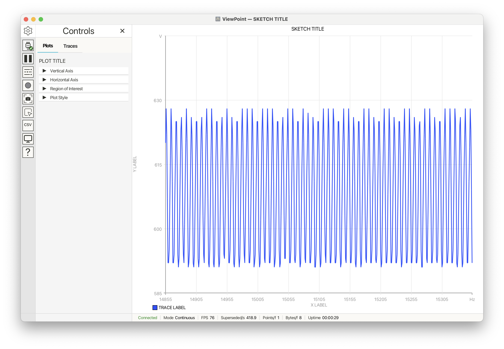

**What the functions do**

- **`setTitle()`** sets the sketch-level title, drawn above the plot
  region and in the desktop window title bar.
- **`setPlotTitle()`** sets the title inside the plot panel.
- **`setAxisLabels()`** sets axis text that is placed alongside each respective axis.
- **`setUnits()`** adds units that are used in analysis features and take the place of the max gridline label.
- **`addData("TRACE LABEL", ...)`** creates a trace by label; the label
  appears in the legend.

**When to use this**

- Skip `setPlotTitle()` for simple single-plot sketches where the
  sketch title is enough.
- Use per-plot labels with `view.plot(i)` in multi-plot dashboards.

**See also**

- `examples/Cartesian/HeartbeatECG/HeartbeatECG.ino`
- `examples/Cartesian/MultiSensorDashboard/MultiSensorDashboard.ino`

---

### 2. Axis ranges and grid spacing

Axis ranges can be configured three ways: bounds only with derived divisions, bounds with a specified division count, or bounds with explicit minor and major step
sizes. This recipe compares the three forms so you can choose between
letting ViewPoint pick readable spacing, requesting a fixed number of
divisions, or matching a domain-specific grid exactly.

```cpp
#include <ViewPoint.h>

void setup() {
    view.begin();
    view.setNumberOfPlots(3);

    view.plot(0).setTitle("min, max");
    view.plot(0).setVerticalRange(-1.0, 1.0);

    view.plot(1).setTitle("min, max, divisions");
    view.plot(1).setVerticalRange(-1.0, 1.0, 8);

    view.plot(2).setTitle("min, max, minor, major");
    view.plot(2).setVerticalRange(-1.0, 1.0, 0.1, 0.5);
}

void loop() {
    view.send();
}
```

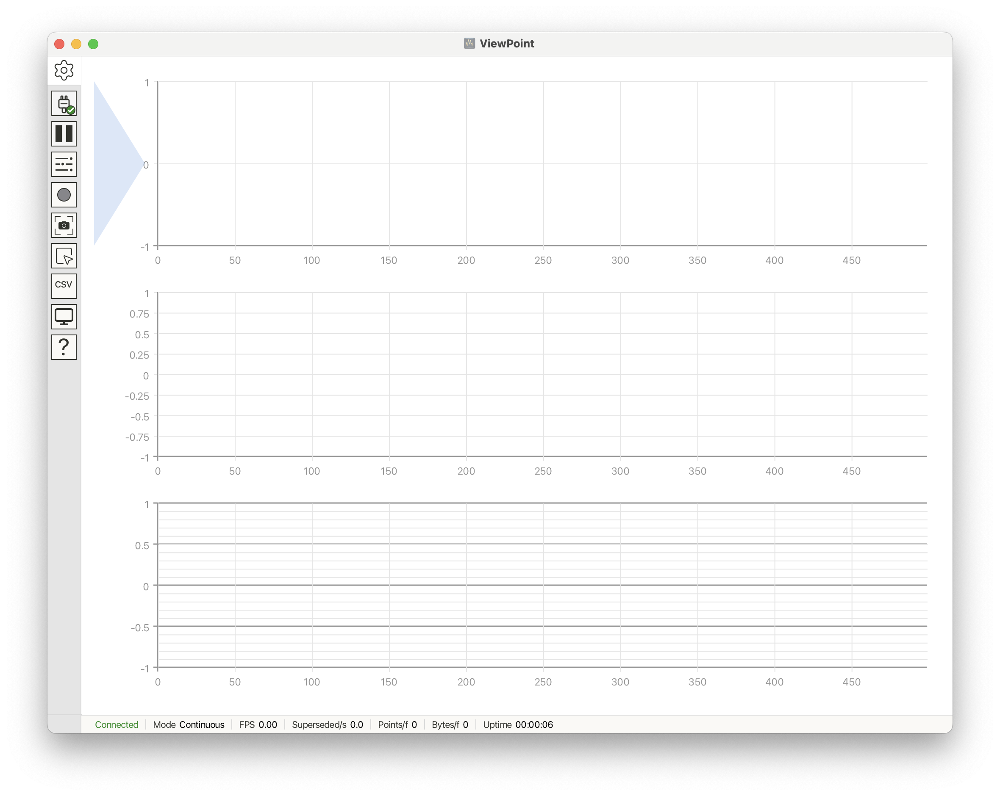

**What the functions do**

- **`setVerticalRange(min, max)`** sets bounds only; ViewPoint chooses
  readable grid spacing.
- **`setVerticalRange(min, max, divisions)`** splits the axis into a
  fixed number of equal segments.
- **`setVerticalRange(min, max, minor, major)`** sets explicit small and
  large grid spacing in data units.

**When to use this**

- Use the `divisions` form when you care about visual count. Setting `divisions` to `1` results in only the major and minor gridlines.
- Use the `minor, major` form when the grid spacing has domain meaning,
  such as 0.1 mV and 0.5 mV on an ECG chart. Major and minor gridlines are different colors and stroke width.

**See also**

- `examples/Cartesian/SignalAnalyzer_A0/SignalAnalyzer_A0.ino`
- `examples/Cartesian/HeartbeatECG/HeartbeatECG.ino`

### 3. Trace colors and the legend

Trace labels control what appears in the legend, and trace colors make
multi-channel plots readable at a glance. This recipe shows both color
forms: named colors from the `colors::` palette, raw RGB/ARGB literals,
and the helper `color(...)` functions.

```cpp
#include <ViewPoint.h>
using namespace viewpoint;

void setup() {
    view.begin();
    view.setTitle("Two-Channel ADC");
    view.setVerticalRange(0, 1023, 100, 200);
    view.trace("A0").setColor(colors::OrangeRed);
    view.trace("A1").setColor(0x00CCFF);                  // RGB literal
    view.trace("Average").setColor(color(128, 0, 255, 0)); // ARGB helper
}

void loop() {
    float a0 = analogRead(A0);
    float a1 = analogRead(A1);
    view.addData("A0", a0);
    view.addData("A1", a1);
    view.addData("Average", (a0 + a1) * 0.5f);
    view.send();
}
```

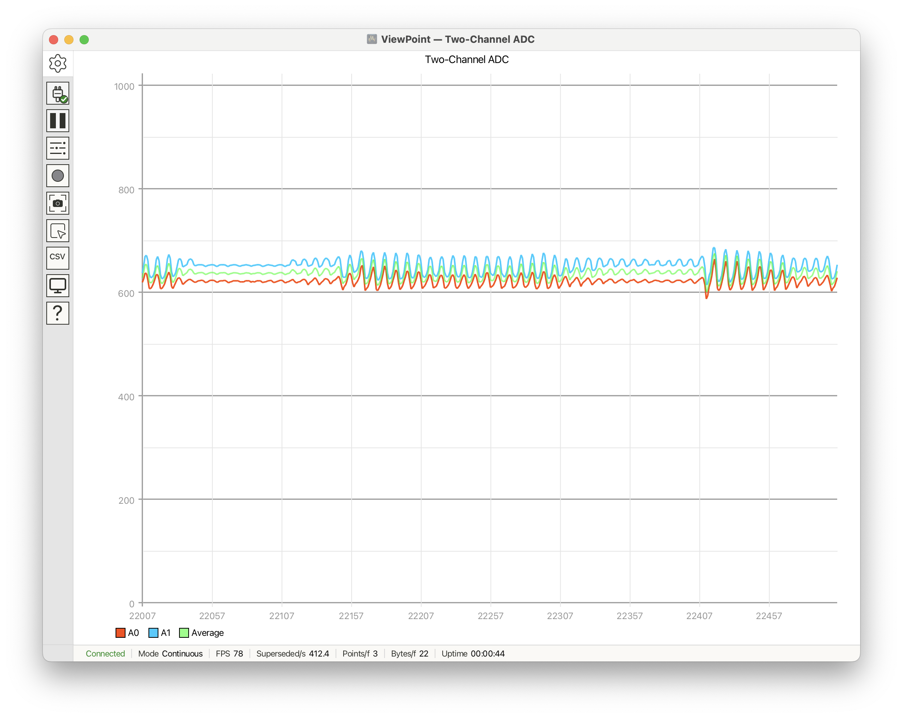

**What the functions do**

- **`view.trace("A0")`** gets or creates a trace by label.
- **`.setColor(colors::OrangeRed)`** chooses a named palette color.
- **`.setColor(0x00CCFF)`** chooses a raw RGB color in `0xRRGGBB`
  form. Fully opaque alpha is assumed.
- **`.setColor(color(128, 0, 255, 0))`** uses the ARGB helper form:
  alpha, red, green, blue. Alpha values run from 0 transparent to 255
  opaque.
- Trace creation order controls legend order and default automapping to
  plots.

**When to use this**

- Use numeric ids, such as `view.trace(0)`, when a sketch generates
  traces programmatically.
- Use labels when the names should be readable in the app and CSV
  capture.
- Use `color(r, g, b)` for explicit opaque RGB values and
  `color(a, r, g, b)` when a trace should be translucent. Raw literals
  work too: `0xRRGGBB` for RGB or `0xAARRGGBB` for ARGB.
- `RGB(0xRRGGBB)` and `ARGB(0xAARRGGBB)` are available when wrapping a
  literal makes the intended format clearer.


### 4. Continuous vs Frames

Continuous mode appends samples to a scrolling history, while Frames
mode replaces the visible packet with the latest complete frame. In
ViewPoint, `continuous` draws new data with each point, while `frames`
draws only after the full data set has been received.

This recipe uses the same burst-shaped data in both sketches. The burst
center stays fixed so the screenshots emphasize update behavior rather
than motion.

#### Continuous mode

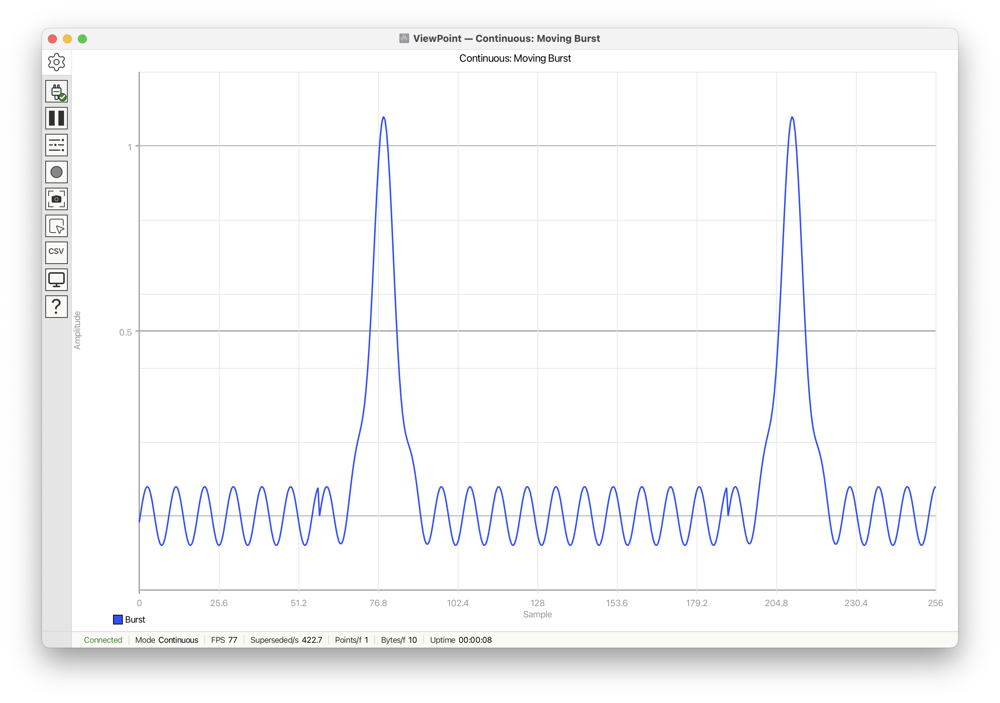

```cpp
#include <ViewPoint.h>
#include <math.h>

const int PACKET_SIZE = 256;

float burstCenter = 40.0f;

float burstValue(int i, float center) {
    float d = i - center;
    float pulse = expf(-(d * d) / (2.0f * 8.0f * 8.0f));
    float ripple = 0.08f * sinf(i * 0.35f);
    return pulse + ripple;
}

void setup() {
    view.begin();
    view.setDelay(2);
    view.setTitle("Continuous: point-by-point drawing");
    view.setPlotTitle("Moving Burst");
    view.setHorizontalRange(0, PACKET_SIZE);
    view.setVerticalRange(-0.2, 1.2, 0.2, 0.5);
    view.setAxisLabels("Sample", "Amplitude");
}

void loop() {
    for (int i = 0; i < PACKET_SIZE; i++) {
        view.addData("Burst", burstValue(i, burstCenter));
        view.send();
    }
}
```

#### Frames mode

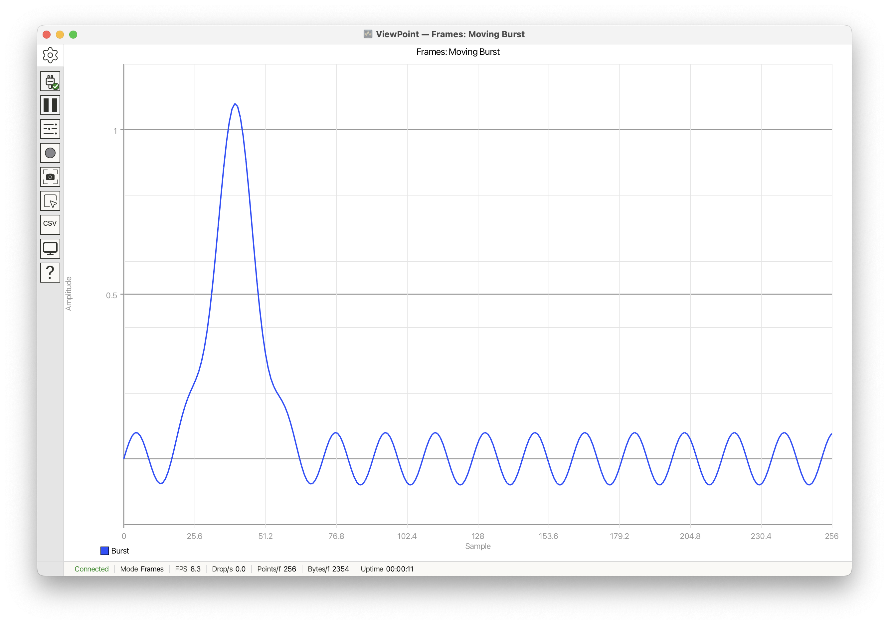

```cpp
#include <ViewPoint.h>
#include <math.h>

const int PACKET_SIZE = 256;

float burstCenter = 40.0f;

float burstValue(int i, float center) {
    float d = i - center;
    float pulse = expf(-(d * d) / (2.0f * 8.0f * 8.0f));
    float ripple = 0.08f * sinf(i * 0.35f);
    return pulse + ripple;
}

void setup() {
    view.begin(frames, PACKET_SIZE);
    view.setDelay(120);
    view.setTitle("Frames: full-packet replacement");
    view.setPlotTitle("Moving Burst");
    view.setHorizontalRange(0, PACKET_SIZE);
    view.setVerticalRange(-0.2, 1.2, 0.2, 0.5);
    view.setAxisLabels("Sample", "Amplitude");
}

void loop() {
    for (int i = 0; i < PACKET_SIZE; i++) {
        view.addData("Burst", burstValue(i, burstCenter));
    }

    view.send();
}
```

**What changes**

- **Continuous:** `view.send()` is called after every point. ViewPoint
  receives and draws the burst one sample at a time, so the plot behaves
  like a scrolling stream.
- **Frames:** `view.send()` is called once after all `PACKET_SIZE`
  samples have been added. ViewPoint receives a complete packet and
  replaces the previous frame in one update.
- **Same data, different timing:** both sketches generate the same burst
  samples. The visible difference comes from when `send()` is called and
  which update mode was selected in `view.begin(...)`.

**When to use this**

- Use Continuous for telemetry, sensor streams, and values that are
  meaningful as history.
- Use Frames for FFTs, oscilloscope captures, histograms, display modes,
  and data where packet boundaries are meaningful.

**See also**

- `examples/Cartesian/Quadrature/Quadrature.ino`


## Tier 2 - Visual Styling

### 5. Custom grid colors and themes

Grid colors are part of the plot's meaning, not just decoration. This
recipe shows how to set label, minor-grid, and major-grid colors so a
plot can match a dark lab environment, domain convention, dashboard
theme, or presentation capture.

```cpp
#include <ViewPoint.h>
using namespace viewpoint;

void setup() {
    view.begin();
    view.setTitle("Dark Theme");
    view.setVerticalRange(-2.0, 2.0, 0.2, 1.0);
    view.setAxisLabels("Time", "Signal");
    view.setGridColors(colors::LightGray, 0x2A2A2A, 0x4A4A4A);
    view.trace("Signal").setColor(colors::Cyan);
}

void loop() {
    view.addData("Signal", sin(millis() / 200.0f));
    view.send();
}
```

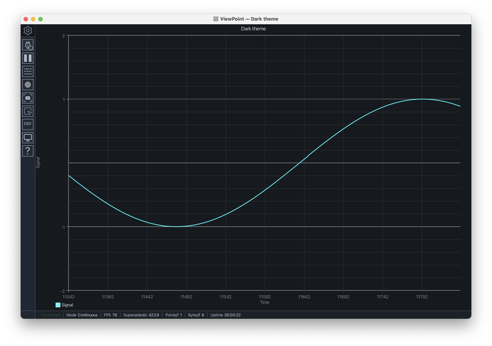

**What the functions do**

- **`setGridColors(labels, minor, major)`** sets axis-label color,
  minor gridline color, and major gridline color.
- The two-argument overload, `setGridColors(minor, major)`, changes
  gridlines without changing label color.

**When to use this**

- Use muted minor lines and stronger major lines for dense plots.
- Use domain colors when the grid itself carries meaning, such as ECG
  paper.

**See also**

- `examples/Cartesian/HeartbeatECG/HeartbeatECG.ino`

### 6. Reference lines: trigger threshold and event marker

Reference lines can mark static values, event positions, or moving
cursors. This recipe combines horizontal threshold lines with vertical
event markers, including an updated marker that moves in `loop()` by
calling `updateVerticalReferenceLine()`.

A synthetic single-supply pulse crosses a trigger threshold, then rings down toward
mid-rail. Horizontal reference lines mark ground, mid-rail, and the
trigger level; a vertical marker moves to the trigger time for each
frame.

```cpp
#include <ViewPoint.h>
#include <math.h>
using namespace viewpoint;

const float VREF = 3.3f;
const float TRIGGER_LEVEL = 2.35f;
const uint32_t SAMPLE_RATE = 20000;   // 20 kSPS
const int DISPLAY_SAMPLES = 400;
const uint32_t FRAME_DELAY_MS = 250;

int triggerMarker = -1;
int triggerIndex = 120;
int triggerStep = 17;
unsigned long lastFrameMs = 0;

float sampleAt(int i, int trigger) {
    float baseline = VREF / 2.0f;
    float noise = random(-15, 16) * 0.001f;
    float t = i - trigger;

    if (t < 0) {
        return baseline + noise;
    }

    float pulse = 1.15f * expf(-t / 45.0f) * cosf(t * 0.28f);
    return baseline + pulse + noise;
}

void setup() {
    view.begin(frames, DISPLAY_SAMPLES);
    view.setDelay(0);
    view.setTitle("Trigger Marker");

    float time_span_us = DISPLAY_SAMPLES * (1.0f / SAMPLE_RATE) * 1e6f;
    float half_span = time_span_us / 2.0f;

    view.setPlotTitle("Triggered Pulse");
    view.setHorizontalRange(-half_span, half_span, 10);
    view.setVerticalRange(-0.2, 3.6, 8);
    view.setAxisLabels("Time", "Voltage");
    view.setUnits("us", "V");

    view.addHorizontalReferenceLine(0.0f, colors::DimGray);
    view.addHorizontalReferenceLine(VREF / 2.0f, colors::DimGray);
    view.addHorizontalReferenceLine(TRIGGER_LEVEL, colors::Yellow, 1.5f);

    float triggerTimeUs = (triggerIndex - DISPLAY_SAMPLES / 2) *
                          (1.0f / SAMPLE_RATE) * 1e6f;
    triggerMarker = view.addVerticalReferenceLine(triggerTimeUs,
                                                  colors::Red,
                                                  2.0f);
    view.trace("Pulse").setColor(colors::Cyan);
}

void loop() {
    unsigned long now = millis();
    if (now - lastFrameMs < FRAME_DELAY_MS) return;
    lastFrameMs = now;

    float triggerTimeUs = (triggerIndex - DISPLAY_SAMPLES / 2) *
                          (1.0f / SAMPLE_RATE) * 1e6f;
    view.updateVerticalReferenceLine(triggerMarker, triggerTimeUs);

    for (int i = 0; i < DISPLAY_SAMPLES; i++) {
        view.addData("Pulse", sampleAt(i, triggerIndex));
    }
    view.send();

    triggerIndex += triggerStep;
    if (triggerIndex > DISPLAY_SAMPLES - 80 || triggerIndex < 80) {
        triggerStep = -triggerStep;
        triggerIndex += triggerStep;
    }
}
```

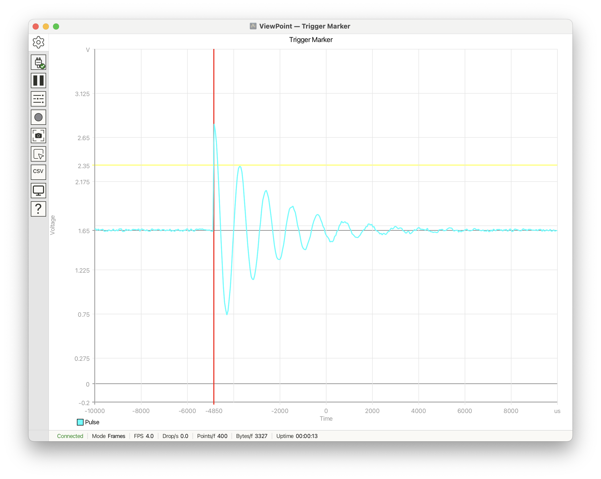
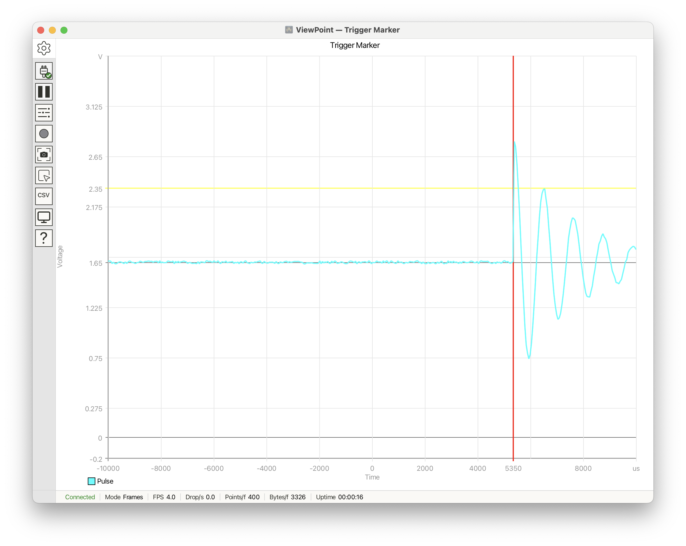

**What's happening**

- **Horizontal lines** identify meaningful voltage levels: ground,
  mid-rail, and the trigger threshold.
- **The vertical marker** identifies when the event occurred in the
  captured frame.
- **`updateVerticalReferenceLine()`** keeps the marker tied to the event
  as the synthetic trigger position moves from frame to frame.
- **Frames mode** makes each update read like a triggered capture rather
  than an endlessly scrolling dashboard.

**What the functions do**

- **`addHorizontalReferenceLine(value, color, stroke)`** draws a flat
  threshold at a y value.
- **`addVerticalReferenceLine(value, color, stroke)`** draws an event
  marker at an x value and returns its reference-line index.
- **`updateVerticalReferenceLine(index, value)`** moves an existing
  marker without creating a new line.

**When to use this**

- Use fixed horizontal lines for alarm thresholds, setpoints, or
  baselines.
- Use updated reference lines for cursors, packet boundaries, trigger
  positions, or latest-event indicators.
- Use `updateHorizontalReferenceLine()` the same way for a moving
  y-axis threshold.

---

## Tier 3 - Domain Configurations

### 7. Oscilloscope-style centered view

An oscilloscope-style view needs a stable time window, predictable
sample timing, and reference lines that make the input range easy to
read. This recipe configures a single time-domain plot in microseconds
with visible ground and mid-rail references.

```cpp
#include <ViewPoint.h>
using namespace viewpoint;

const float VREF = 3.3f;
const uint32_t SAMPLE_RATE = 10000;     // 10 kSPS
const int DISPLAY_SAMPLES = 500;
const uint32_t SAMPLE_INTERVAL_US = 1000000UL / SAMPLE_RATE;

uint32_t lastSampleUs = 0;

void setup() {
    view.begin();
    view.setDelay(0);
    view.setTitle("Oscilloscope");

    float time_span_us = DISPLAY_SAMPLES * (1.0f / SAMPLE_RATE) * 1e6f;
    float half_span = time_span_us / 2.0f;

    view.setPlotTitle("Oscilloscope");
    view.setVerticalRange(-0.5, 3.5, 8);
    view.setHorizontalRange(-half_span, half_span, 10);
    view.setAxisLabels("Time", "Voltage");
    view.setUnits("us", "V");
    view.addHorizontalReferenceLine(VREF / 2.0f, colors::DimGray);
    view.addHorizontalReferenceLine(0.0f, colors::DimGray);
}

void loop() {
    uint32_t now = micros();
    if (now - lastSampleUs < SAMPLE_INTERVAL_US) return;
    lastSampleUs += SAMPLE_INTERVAL_US;

    float volts = analogRead(A0) * VREF / 1023.0f;
    view.addData("Probe", volts);
    view.send();
}
```

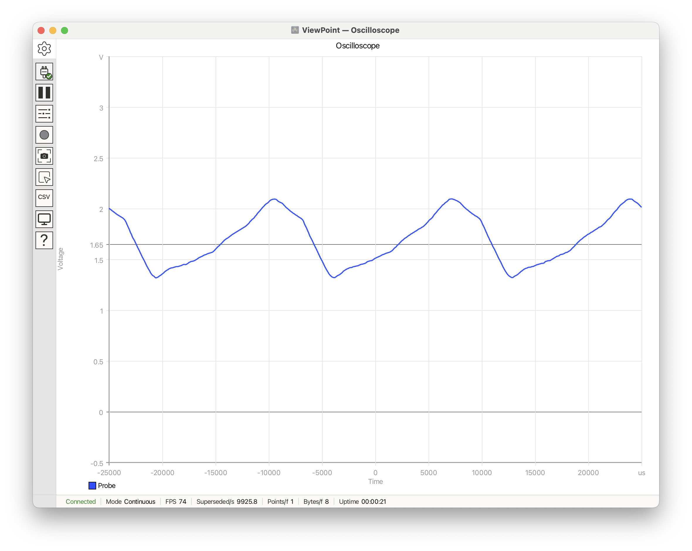

**What the functions do**

- **`setDelay(0)`** disables the library's built-in delay so the
  `micros()` gate controls sample cadence.
- **`time_span_us` and `half_span`** convert sample count and sample
  rate into a centered microsecond window.
- **`setHorizontalRange(-half_span, half_span, 10)`** gives the
  time-domain view a stable left/right span around zero.
- **`setVerticalRange(-0.5, 3.5, 8)`** frames a 0-3.3 V ADC signal with
  headroom above and below the rails.
- **Reference lines at `VREF / 2.0f` and `0.0f`** mark mid-rail and
  ground, common scope landmarks for single-supply signals.

**When to use this**

- Change `VREF`, ADC scaling, `SAMPLE_RATE`, and `DISPLAY_SAMPLES` to
  match your board and acquisition path.
- Use `examples/Cartesian/SignalAnalyzer_A0/SignalAnalyzer_A0.ino` when
  you need a DMA-backed high-rate capture instead of loop-timed samples.

**See also**

- `examples/Cartesian/SignalAnalyzer_A0/SignalAnalyzer_A0.ino`

### 8. ECG-style strip chart

An ECG-style strip chart is a good example of domain-specific plot
configuration: the grid spacing, colors, units, baseline, and scroll
rate all work together. This recipe shows how those calls combine to
produce a recognizable medical-paper display.

```cpp
#include <ViewPoint.h>
#include <math.h>

float phase = 0.0f;

float ecgSample(float p) {
    if (p < 0.10f) return 0.15f * sinf((p / 0.10f) * PI);
    if (p < 0.16f) return 0.0f;
    if (p < 0.18f) return -0.10f * sinf(((p - 0.16f) / 0.02f) * PI);
    if (p < 0.22f) return 1.20f * sinf(((p - 0.18f) / 0.04f) * PI);
    if (p < 0.24f) return -0.20f * sinf(((p - 0.22f) / 0.02f) * PI);
    if (p < 0.40f) return 0.05f;
    if (p < 0.56f) return 0.30f * sinf(((p - 0.40f) / 0.16f) * PI);
    return 0.0f;
}

void setup() {
    view.begin();
    view.setDelay(4);
    view.setTitle("Heartbeat ECG");
    view.setPlotTitle("Lead II");
    view.setAxisLabels("Time", "Voltage");
    view.setUnits("s", "mV");
    view.setVerticalRange(-0.5, 1.5, 0.1, 0.5);
    view.setGridColors(0xFFCCCC, 0xFF6666);
    view.addHorizontalReferenceLine(0.0f);
    view.trace("Lead II").setColor(0x00AA00);
}

void loop() {
    view.addData("Lead II", ecgSample(phase));
    view.send();
    phase += 0.0048f;
    if (phase >= 1.0f) phase -= 1.0f;
}
```

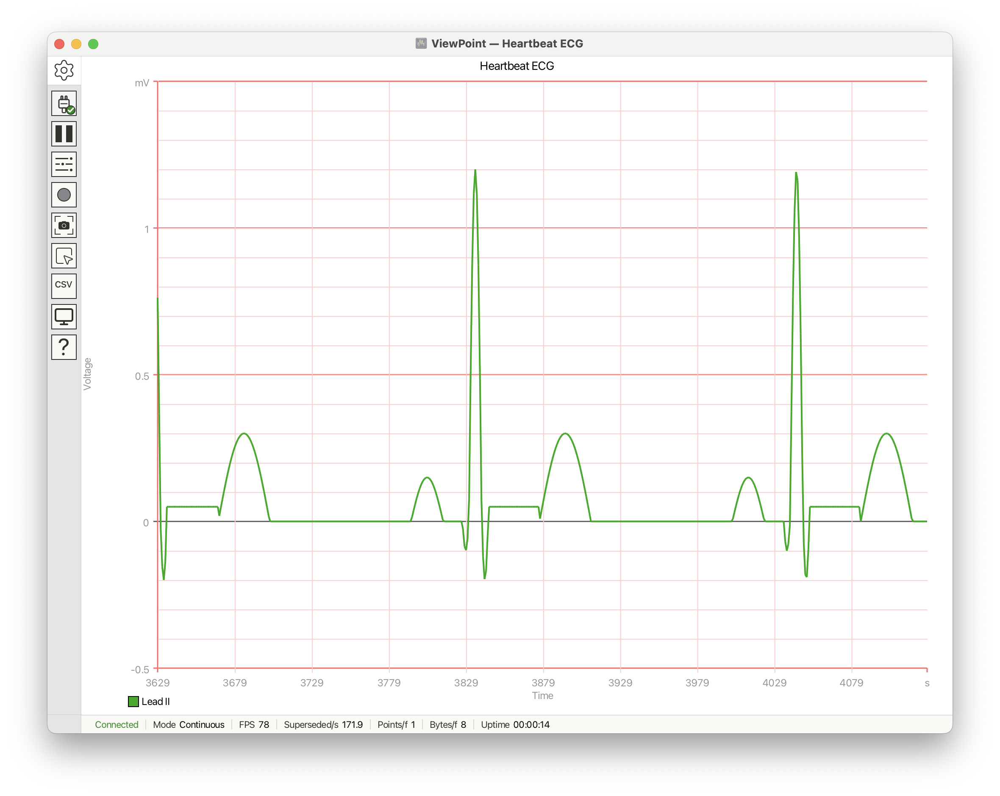

**What the functions do**

- **`setVerticalRange(-0.5, 1.5, 0.1, 0.5)`** creates the small and
  large divisions expected on ECG paper.
- **`setGridColors(0xFFCCCC, 0xFF6666)`** gives the plot the medical
  paper look.
- **`addHorizontalReferenceLine(0.0f)`** marks the isoelectric baseline.

**When to use this**

- Adjust the vertical range when your signal is not in millivolts.
- Change `setDelay()` and the phase increment together if you want a
  faster or slower sweep.

**See also**

- `examples/Cartesian/HeartbeatECG/HeartbeatECG.ino`

### 9. Wide-range sensor on a log axis

Some sensors produce values that span several orders of magnitude, where
a linear axis hides the low end or lets the high end dominate. This
recipe shows a logarithmic vertical axis with positive data, fixed
decade bounds, and reference lines that remain readable across the full
range. The simulation models a vacuum chamber being pumped down by starting at 
atmospheric pressure (~1e5 Pa) and decaying exponentially toward the pump's 
ultimate base pressure (1e-3 Pa) with an 8-second time constant, plus ±3% 
multiplicative noise so the jitter reads uniformly across all decades on the log axis.

```cpp
#include <ViewPoint.h>
#include <math.h>
using namespace viewpoint;

const float P_ATM      = 1.0e5f;   // starting pressure (atmosphere), Pa
const float P_ULTIMATE = 1.0e-3f;  // base pressure the pump can reach, Pa
const float TAU        = 8.0f;     // pumping time constant, seconds

unsigned long t0;

float readVacuumGauge() {
    float t = (millis() - t0) / 1000.0f;                 // seconds since pump start
    // Exponential approach from atmosphere toward the ultimate pressure.
    float p = P_ULTIMATE + (P_ATM - P_ULTIMATE) * expf(-t / TAU);
    // Multiplicative noise (~+/-3%) so it reads like a real gauge on a log axis.
    float noise = 1.0f + (random(-30, 31) / 1000.0f);
    return p * noise;
}

void setup() {
    view.begin();
    view.setDelay(100);
    view.setTitle("Vacuum Chamber Pump-Down");
    view.setPlotTitle("Chamber Pressure");
    view.setVerticalRange(1e-3, 1e5);                            // 8 decades: high vacuum -> atmosphere
    view.enableLogarithmicScale();
    view.setAxisLabels("Time", "Pressure");
    view.setUnits("s", "Pa");
    view.addHorizontalReferenceLine(100.0f, colors::Goldenrod, 1.0f);  // rough/medium boundary
    view.addHorizontalReferenceLine(0.1f,   colors::Orange,    1.5f);  // medium/high boundary
    view.trace("Gauge").setColor(colors::Gold);

    t0 = millis();
}

void loop() {
    float pressure = readVacuumGauge();
    view.addData("Gauge", pressure);
    view.send();
}
```

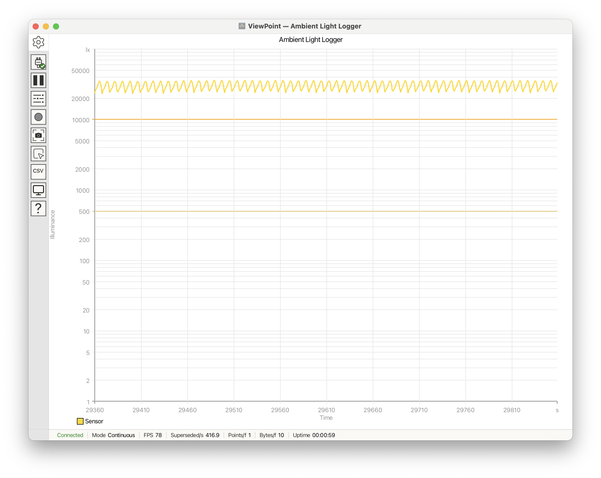

**What the functions do**

- **`enableLogarithmicScale()`** maps positive linear values onto a log
  vertical axis.
- **`setVerticalRange(1, 100000)`** spans five decades; the minimum must
  be greater than zero.
- **Reference lines** keep meaningful environmental levels visible
  across the compressed scale.

**When to use this**

- Use `enableLogarithmicScale(false)` when the data is already in log
  space, such as dB.
- Clamp or filter zero/negative values before plotting on a log axis.

### 10. Multi-plot stacked monitor

Multi-plot layouts let unrelated signals share one session without
forcing them onto the same scale. This recipe builds a stacked dashboard
where each plot has its own title, range, units, reference lines, and
trace color.

```cpp
#include <ViewPoint.h>
using namespace viewpoint;

float temperature = 25.0f;
float tempTarget = 25.0f;
float vibPhase = 0.0f;
float pressure = 1013.0f;
float pressureTarget = 1013.0f;

void setup() {
    view.begin();
    view.setDelay(50);
    view.setTitle("Sensor Dashboard");
    view.setNumberOfPlots(3);

    view.plot(0).setTitle("Temperature");
    view.plot(0).setVerticalRange(0, 50, 5, 10);
    view.plot(0).setAxisLabels("Time", "Temp");
    view.plot(0).setUnits("s", "C");
    view.plot(0).addHorizontalReferenceLine(40.0f, colors::Red, 1.5f);

    view.plot(1).setTitle("Vibration");
    view.plot(1).setVerticalRange(-10, 10, 2, 5);
    view.plot(1).setAxisLabels("Time", "Velocity");
    view.plot(1).setUnits("s", "mm/s");

    view.plot(2).setTitle("Pressure");
    view.plot(2).setVerticalRange(900, 1100, 20, 50);
    view.plot(2).setAxisLabels("Time", "Pressure");
    view.plot(2).setUnits("s", "hPa");
    view.plot(2).addHorizontalReferenceLine(1013.25f, colors::Green, 1.5f);

    view.trace("Temp").setColor(colors::Red);
    view.trace("Vib").setColor(colors::Green);
    view.trace("Press").setColor(colors::Blue);
}

void loop() {
    if (random(100) < 2) tempTarget = 20.0f + random(20);
    temperature += (tempTarget - temperature) * 0.01f;
    temperature += random(-10, 10) / 100.0f;

    vibPhase += 0.3f;
    float vib = 5.0f * sin(vibPhase) + 2.0f * sin(vibPhase * 3.7f);
    vib += random(-10, 10) / 10.0f;

    if (random(100) < 1) pressureTarget = 950.0f + random(100);
    pressure += (pressureTarget - pressure) * 0.05f;
    pressure += random(-5, 5) / 10.0f;

    view.addData("Temp", temperature);
    view.addData("Vib", vib);
    view.addData("Press", pressure);
    view.send();
}
```

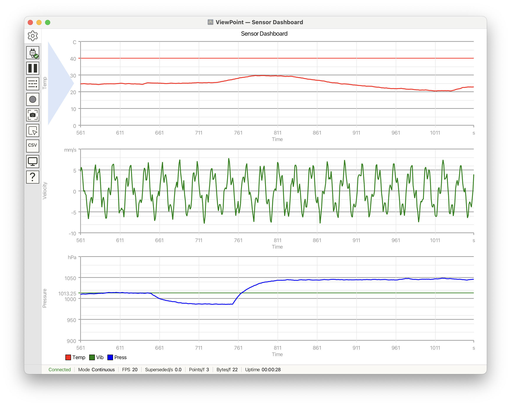

**What the functions do**

- **`setNumberOfPlots(3)`** creates three stacked plot panels.
- **`view.plot(i)`** configures one panel's title, axis range, units,
  labels, and reference lines.
- **Trace automap** pairs traces with plots in creation order when no
  explicit assignment is made.

**When to use this**

- Call `view.plot(i).addTrace(traceId)` when automap is not the desired
  trace-to-plot assignment.
- Use separate scales whenever signals have different units or ranges.

**See also**

- `examples/Cartesian/MultiSensorDashboard/MultiSensorDashboard.ino`

---

## Tier 4 - Polar and Scatter Shape

### 11. Polar angular conventions

Polar plots are only useful when the angular convention matches the
problem. This recipe compares the two common conventions side by side:
compass-style degrees with 0 at the top, and mathematical radians with
0 at the right.

#### Compass convention: degrees, 0 at top

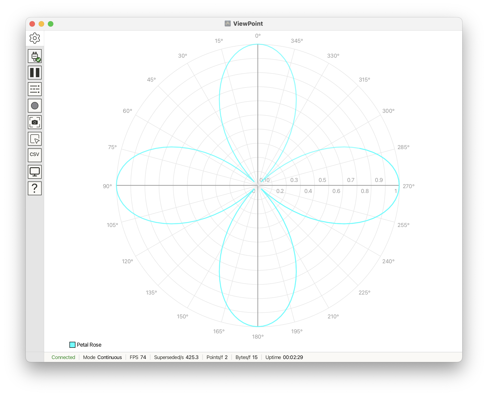


```cpp
#include <ViewPoint.h>
using namespace viewpoint;

float theta = 0.0f;

void setup() {
    view.begin(polar);
    view.setAngularUnits(AngularUnit::Degrees);
    view.setAngularOffset(90);
    view.setAngularStep(15);
    view.setRadialRange(0, 1);
    view.trace("Petal Rose").setColor(colors::Cyan);
}

void loop() {
    view.addData("Petal Rose", fabs(cos(2 * theta * DEG_TO_RAD)), theta);
    view.send();
    theta += 2.0f;
    if (theta >= 360.0f) theta -= 360.0f;
}
```


#### Math convention: radians, 0 at right

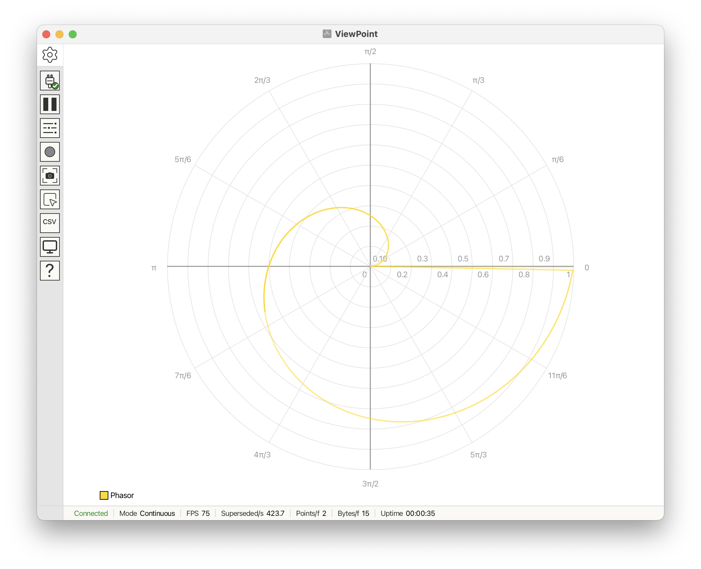

```cpp
#include <ViewPoint.h>
using namespace viewpoint;

float theta = 0.0f;

void setup() {
    view.begin(polar);
    view.setRadians();
    view.setAngularStep(30);
    view.setRadialRange(0, 1);
    view.trace("Phasor").setColor(colors::Gold);
}

void loop() {
    view.addData("Phasor", 0.75f, theta);
    view.send();
    theta += 0.03f;
    if (theta >= TWO_PI) theta -= TWO_PI;
}
```


**What the functions do**

- **`setAngularOffset(90)`** rotates the compass plot so 0 degrees is
  at the top.
- **`setRadians()`** switches incoming angle values and angular offset
  to radians.
- **`setAngularStep()`** controls grid spacing. It currently accepts
  whole degrees even when the angular unit is radians.
- **`setRadialRange(0, 1)`** creates a unit-radius plot suitable for a
  normalized bearing or phasor.

**When to use this**

- Use compass convention for heading, bearing, wind, sonar, and
  direction displays.
- Use math convention for phasors, unit circles, parametric curves, and
  complex-plane work.
- For wind-rose or histogram displays, use Polar + Frames and set the
  packet size to the number of angular bins.

**See also**

- `examples/Polar/HelloPolar/HelloPolar.ino`
- `examples/Polar/CustomGrid/CustomGrid.ino`
- `examples/Polar/WindRoseChart/WindRoseChart.ino`

### 12. Scatter with breaks

Scatter and Polar traces normally connect consecutive points. This
recipe shows how `addBreak()` inserts an intentional discontinuity so a
single trace can draw separate strokes, paths, or phasor segments
without unwanted bridge lines.

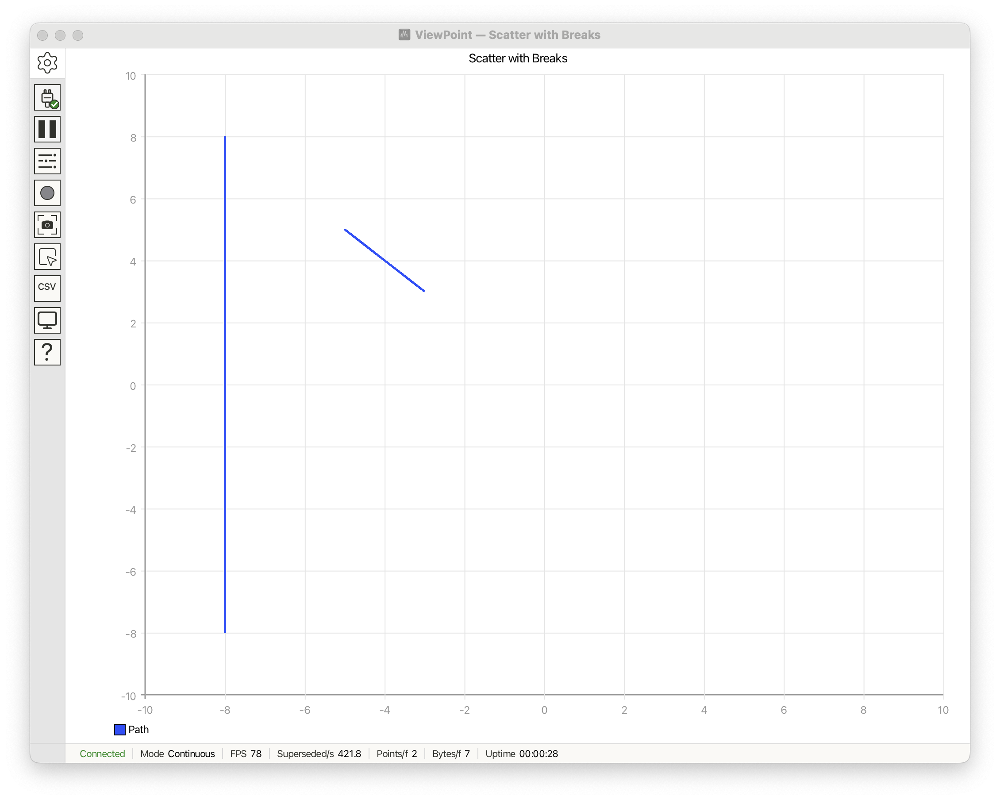

```cpp
#include <ViewPoint.h>

void setup() {
    view.begin(scatter);
    view.setTitle("Scatter with Breaks");
    view.setHorizontalRange(-10, 10);
    view.setVerticalRange(-10, 10);
}

void loop() {
    // view.addBreak("Curve");   // don't bridge the two curves
    for (float x = -5.0f; x <= 5.0f; x += 0.25f) {
        view.addData("Curve", x, 1.0f / x);
    }
    view.send();
}
```

**What the functions do**

- **`addData("Curve", x, y)`** appends paired points to a Scatter trace.
- **`addBreak("Curve")`** lifts the pen so the next point starts a new stroke, essential when one trace spans a discontinuity (an asymptote, a sensor dropout, or separate phasor segments) and you don't want the gap bridged by a connecting line.
- **`view.begin(scatter)`** selects the plot type where arbitrary paired (x, y) data is meaningful; sets the update mode to Frames; sets the number of points per frame to 40.

**When to use this**

- Use Frames mode when each screen update should redraw a complete
  multi-segment figure.
- Use the same `addBreak()` pattern in Polar for phasor diagrams and
  radial line segments.

**See also**

- `examples/Scatter/HolographicSurfaces/HolographicSurfaces.ino`
- `examples/Scatter/Fireworks/Fireworks.ino`
- `examples/Polar/PolarPhasorDiagram/PolarPhasorDiagram.ino`

## Tier 5 - Frames Mode and Display Modes

### 13. Display modes from the same frame stream

Display modes are easiest to understand when the same frame stream is
rendered three different ways. This recipe uses the SignalCore library
(docs: https://docs.voidloop.com/libraries/SignalCore/) to generate a
sweeping spectrum, then shows Persistence, Spectrogram, and Gradient on
stacked plots so their different uses are directly comparable.

Note that all three plots share the same base configuration, this is easily applied by using the base plot. Individual (display mode) configuration is applied to each plot independently.

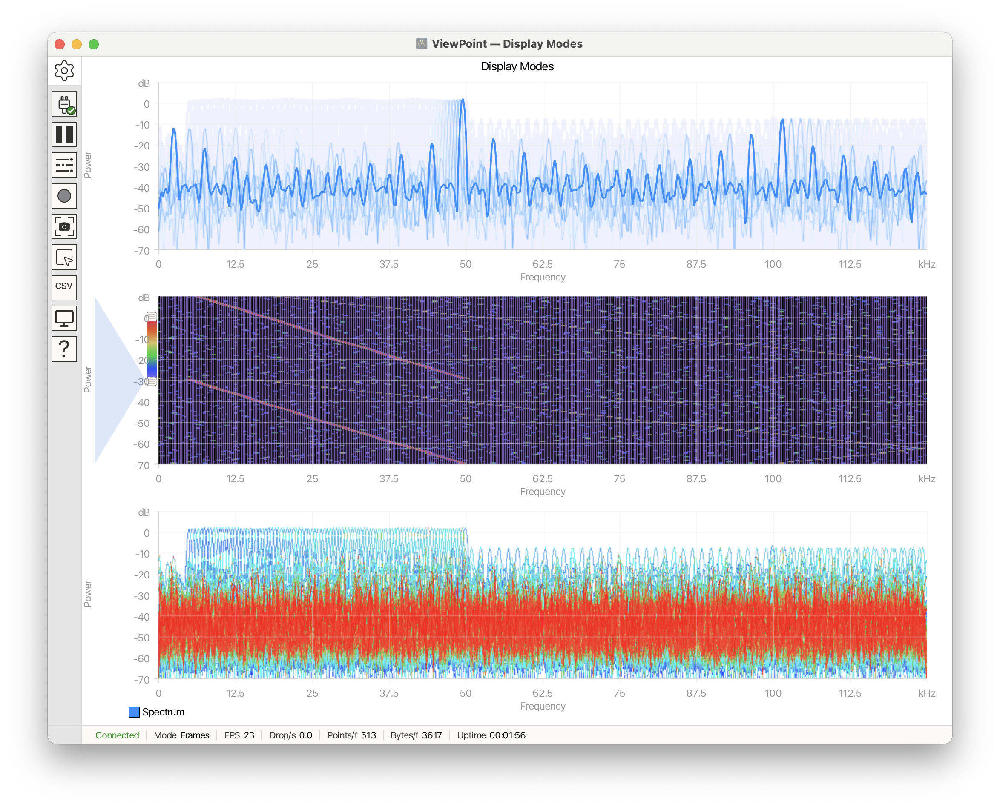

```cpp
#include <ViewPoint.h>
#include <SignalCore.h>

using namespace viewpoint;
using namespace signalcore;

#define SAMPLE_RATE 250000
#define FFT_SIZE 1024
#define FFT_OUTPUT_SIZE (FFT_SIZE / 2 + 1)
#define CARRIER_START 5000
#define CARRIER_END 50000
#define CARRIER_STEP 500

SignalGenerator sig(SAMPLE_RATE);
FFT<(FFTSize)FFT_SIZE> fft;
float samples[FFT_SIZE];
uint32_t carrier = CARRIER_START;

void setup() {
    view.begin(frames, FFT_OUTPUT_SIZE);
    view.setDelay(40);
    view.setTitle("Display Modes");
    view.setNumberOfPlots(3);

    view.trace("Spectrum").setColor(colors::DodgerBlue);

    // Apply base configuration to each plot
    view.setHorizontalRange(0, SAMPLE_RATE / 2000, 10);
    view.setVerticalRange(-70, 10, 8);
    view.setAxisLabels("Frequency", "Power");
    view.setUnits("kHz", "dB");
    
    // Apply individual configuration to each plot
    view.plot(0).setTitle("Persistence");
    view.plot(0).setDisplayMode(persistence, 0);

    view.plot(1).setTitle("Spectrogram");
    view.plot(1).setDisplayMode(spectrogram, 0);

    view.plot(2).setTitle("Gradient");
    view.plot(2).setDisplayMode(gradient, 0);

    sig.setCarrier(SignalShape::Square, carrier);
    sig.setAM(SignalShape::Sine, 2, 0.01);
    sig.setNoise(3.0f);
    fft.setWindowType(WindowType::BlackmanHarris);
}

void loop() {
    for (int i = 0; i < FFT_SIZE; i++) {
        samples[i] = 1.65f * sig.nextSample(0);
    }

    fft.calculate(samples);
    fft.postScaleDB(-120, 1.65f);

    view.addData("Spectrum", (float*)fft, FFT_OUTPUT_SIZE);
    view.send();

    carrier += CARRIER_STEP;
    if (carrier > CARRIER_END) carrier = CARRIER_START;
    sig.setCarrier(SignalShape::Square, carrier);
}
```

**What the functions do**

- **`view.begin(frames, FFT_OUTPUT_SIZE)`** makes each FFT output one
  complete frame.
- **`setDisplayMode(persistence, 0)`** keeps previous frames visible as
  fading trails.
- **`setDisplayMode(spectrogram, 0)`** turns each frame into a waterfall
  column.
- **`setDisplayMode(gradient, 0)`** accumulates repeated hits into a
  heatmap.

**When to use this**

- Use Persistence for transient capture and repeated overlays.
- Use Spectrogram to view amplitude as color over time.
- Use Gradient when you want to see where frame data accumulates most
  often.
- Keep axis ranges fixed; auto-scaling makes display-mode comparisons
  harder to read.

**See also**

- `examples/Cartesian/SpectrumAnalyzer/SpectrumAnalyzer.ino`
